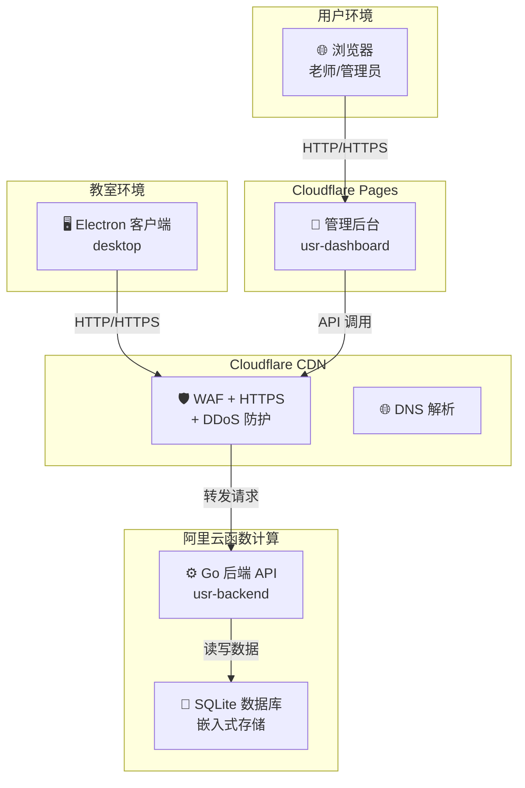
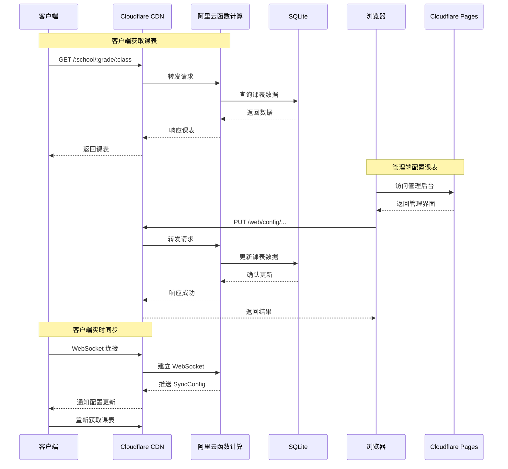
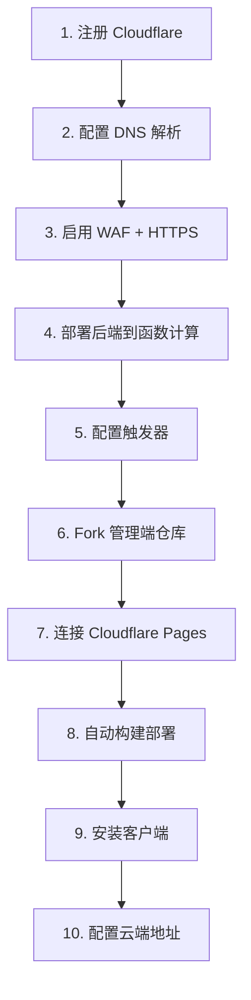
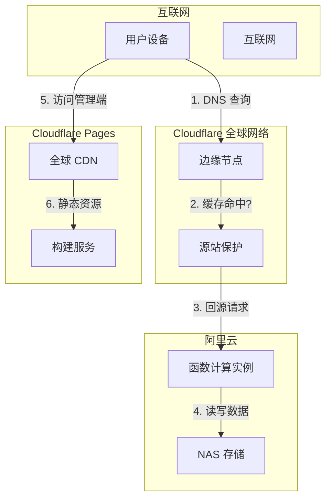
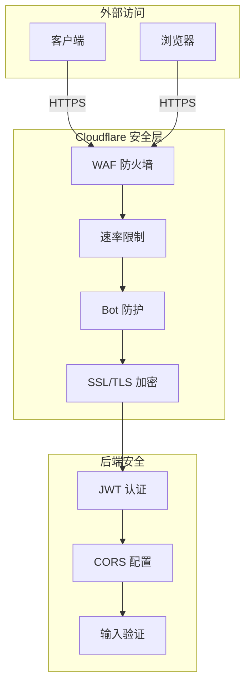

> [!DANGER]
> 本页由 AI 工具参考代码编写，尚未经过人工审核，内容仅供参考。如果无法解决问题或需要协助部署，可邮箱联系：kuohu@getastra.cn

# 极低成本外网部署架构图

## 架构概览

## 数据流

## 部署流程

## 组件说明

| 组件 | 技术栈 | 部署位置 | 费用 |
|------|--------|----------|------|
| **客户端** | Electron 22 + JS + jQuery | 教室电脑 | 免费 |
| **管理后台** | Vue3 + Vite + Naive UI | Cloudflare Pages | 免费 |
| **后端 API** | Go 1.26 + Gin + GORM | 阿里云函数计算 | ≈5元/月（假期不计费） |
| **数据库** | SQLite | 嵌入云函数实例 | 免费 |
| **安全防护** | Cloudflare CDN | 全球 CDN | 免费 |
| **域名** | 自定义域名 | Cloudflare | 不等 |

## 网络拓扑

## 安全架构

## 成本分析

| 项目 | 月费用 | 年费用 | 说明 |
|------|--------|--------|------|
| 域名 | - | ≈40元 | .cn 域名（按需求可以选别的更便宜的） |
| 函数计算 | ≈5元 | ≈45元 | 按调用次数计费（寒暑假不计费） |
| Cloudflare Pages | 0 | 0 | 免费 |
| Cloudflare | 0 | 0 | 免费 |
| **总计** | **≈5元** | **≈85元** | **极低成本** |

## 优势

1. **成本极低**：年费仅约85元，适合预算有限的学校/个人
2. **无需运维**：Serverless 架构，自动弹性伸缩
3. **安全可靠**：Cloudflare 提供外网安全防护
4. **数据安全**：SQLite 嵌入式存储，冷启动快，成本低廉

## 注意事项

1. **SQLite 限制**：单实例存储，并发写入有限，对于规模超过 3000 个班级的区域不建议使用此方案
2. **冷启动**：Serverless 函数可能有冷启动延迟，但通常可接受
