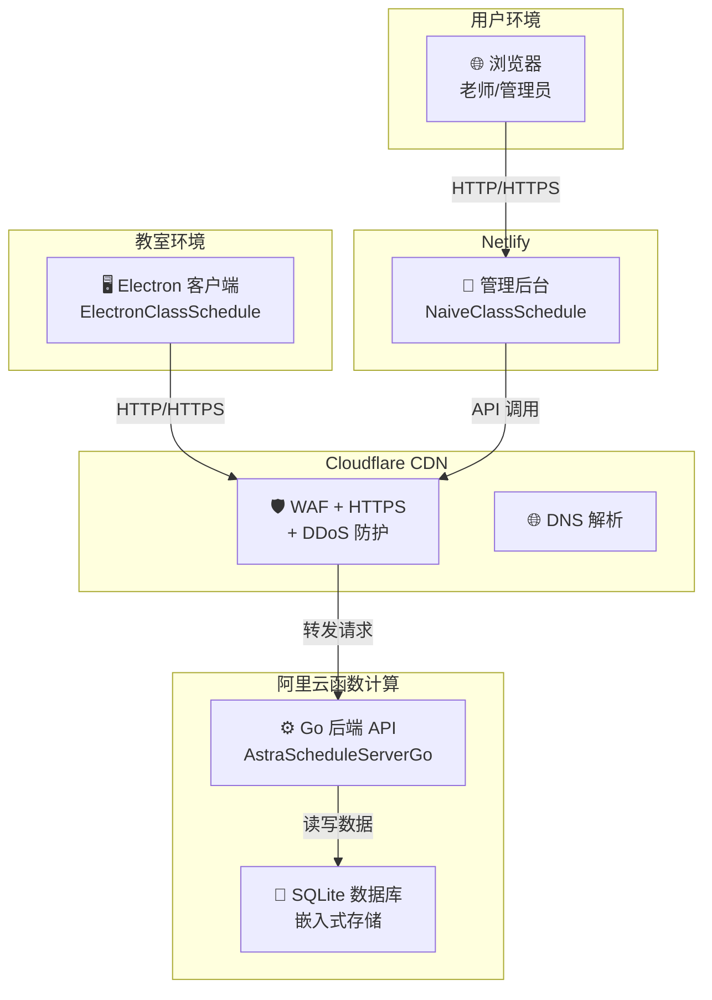

> [!DANGER]
> 本页由 AI 工具参考代码编写，尚未经过人工审核，内容仅供参考。如果无法解决问题或需要协助部署，可邮箱联系：kuohu@getastra.cn

# 极低成本外网部署

适合大多数学校。

## 架构

> 💡 详细的架构说明请参考 [架构图详解](./architecture.md)

## 方案说明

| 组件 | 选型 | 说明 |
|------|------|------|
| 后端 | 阿里云函数计算 | Go 运行时 |
| 数据库 | SQLite | 无需安装，数据存在云函数实例中 |
| 管理端 | Netlify | 免费托管，自动从 GitHub 构建部署 |
| 安全防护 | Cloudflare CDN | 免费 WAF + HTTPS + DDoS 防护 |

## 你需要准备

- 一个域名（十几到几十元/年）
- 阿里云账号（实名认证）
- GitHub 账号
- Cloudflare 账号（免费）

## 成本

| 项目 | 费用 |
|------|------|
| 域名 | ≈ 40 元/年 |
| 函数计算 | ≈ 5 元/月 |
| Netlify | 免费 |
| Cloudflare CDN | 免费 |
| **合计** | **≈ 85 元/年** |

## 部署步骤

1. [注册并配置 Cloudflare](./cloudflare.md) — DNS 解析 + WAF + HTTPS
2. [部署后端到函数计算](./server-fc.md) — 上传代码，配置触发器
3. [获取和风天气 API 凭证](./weather-api.md) — 配置天气功能
4. [部署管理端到 Netlify](./web-netlify.md) — Fork 仓库 → 一键部署
5. [安装客户端](./client.md) — 教室电脑安装配置

> 💡 本方案使用阿里云函数计算，你也可以部署在腾讯云函数、AWS Lambda 等任何你熟悉的 Serverless 平台。

> 📝 **天气功能**：如果需要为客户端提供天气信息，请在部署后端后配置和风天气 API。详见 [获取和风天气 API 凭证](./weather-api.md)。
